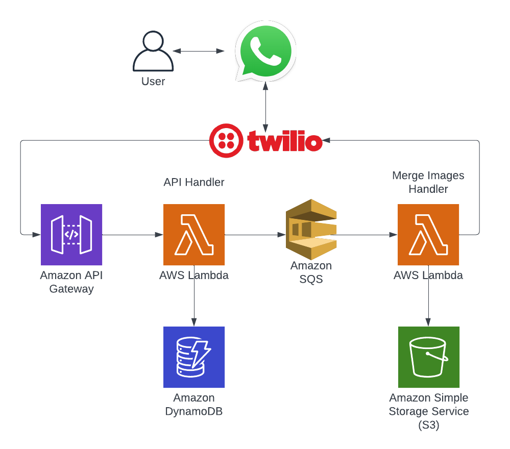

# Merge Images Bot

Bot para mesclar duas imagens via WhatsApp.



## 🚀 Começando

Essas instruções permitirão que você obtenha uma cópia do projeto em operação na sua máquina local para fins de desenvolvimento e teste.

### 📋 Pré-requisitos

De que coisas você precisa para instalar o software e como instalá-lo?

* Serverless Framework ([link](https://www.serverless.com/framework/docs/getting-started/))
* Conta AWS e CLI configurada ([link](https://docs.aws.amazon.com/cli/latest/userguide/getting-started-install.html))
* Conta Twilio e credenciais ([link](https://www.twilio.com/docs/usage/tutorials/how-to-use-your-free-trial-account))

### 🔧 Instalação

1. Clone o repositório
    ```sh
    git clone git@github.com:marcioecom/merge-images-bot.git
    ```
2. Instale os pacotes
    ```sh
    npm install # ou yarn
    ```
3. Configure as variáveis de ambiente
    ```sh
    cp .env.example .env
    ```
    Preencha as variáveis de ambiente no arquivo .env

4. Execute localmente
    ```sh
    sls invoke local -f jobsWorker --path mock/mergeImage.data.json \
      -e TWILIO_ACCOUNT_SID=your-account-sid \
      -e TWILIO_AUTH_TOKEN=your-auth-token \
    ```

5. Deploy
    ```sh
    sls deploy --stage dev
    ```

## 🛠️ Construído com

* [Serverless](https://www.serverless.com/) - Framework para construir aplicativos sem servidor
* [Lambda](https://aws.amazon.com/pt/lambda/) - Usada para executar funções sem provisionar ou gerenciar servidores
* [Api Gateway](https://aws.amazon.com/pt/api-gateway/) - Usada para criar, publicar, manter, monitorar e proteger APIs em escala
* [DynamoDB](https://aws.amazon.com/pt/dynamodb/) - Banco de dados NoSQL
* [SQS](https://aws.amazon.com/pt/sqs/) - Serviço de filas de mensagens
* [S3](https://aws.amazon.com/pt/s3/) - Armazenamento de objetos
* [Twilio](https://www.twilio.com/) - Plataforma de integração com a API do WhatsApp
