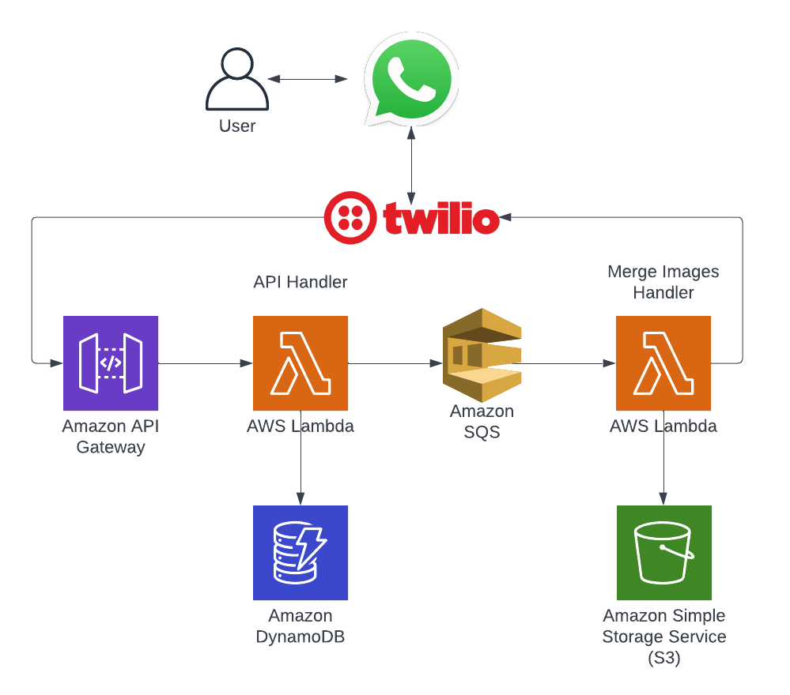

# Merge Images Bot

A WhatsApp bot that merges two images into one using AWS serverless infrastructure.



## Tech Stack

- **AWS Lambda** - serverless compute for processing functions
- **AWS API Gateway** - HTTP API endpoint for Twilio webhooks
- **AWS DynamoDB** - NoSQL storage for image metadata
- **AWS SQS** - message queue for async image processing
- **AWS S3** - object storage for images
- **Twilio** - WhatsApp API integration
- **Serverless Framework** - infrastructure as code and deployment

## Prerequisites

- [Serverless Framework](https://www.serverless.com/framework/docs/getting-started/)
- [AWS CLI configured](https://docs.aws.amazon.com/cli/latest/userguide/getting-started-install.html)
- [Twilio account and credentials](https://www.twilio.com/docs/usage/tutorials/how-to-use-your-free-trial-account)

## Getting Started

1. Clone the repository
    ```sh
    git clone git@github.com:marcioecom/merge-images-bot.git
    ```
2. Install dependencies
    ```sh
    npm install
    ```
3. Set up environment variables
    ```sh
    cp .env.example .env
    ```
    Fill in the required values in the `.env` file.

4. Run locally
    ```sh
    sls invoke local -f jobsWorker --path mock/mergeImage.data.json \
      -e TWILIO_ACCOUNT_SID=your-account-sid \
      -e TWILIO_AUTH_TOKEN=your-auth-token
    ```

5. Deploy
    ```sh
    sls deploy --stage dev
    ```

## Built With

- [Serverless Framework](https://www.serverless.com/) - build and deploy serverless applications
- [AWS Lambda](https://aws.amazon.com/lambda/) - run code without provisioning servers
- [AWS API Gateway](https://aws.amazon.com/api-gateway/) - create and manage APIs at scale
- [AWS DynamoDB](https://aws.amazon.com/dynamodb/) - managed NoSQL database
- [AWS SQS](https://aws.amazon.com/sqs/) - managed message queue service
- [AWS S3](https://aws.amazon.com/s3/) - object storage
- [Twilio](https://www.twilio.com/) - WhatsApp API integration platform
